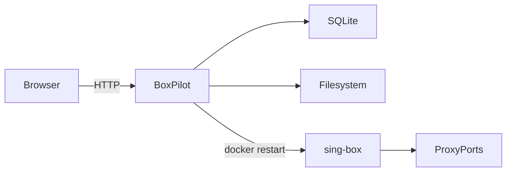

# BoxPilot

> A self-hosted control plane for managing sing-box subscriptions and runtime configuration.  
> Built with Go + Gin + SQLite + Vite + React.

BoxPilot is designed for **personal use** and focuses on:

- Managing sing-box subscription links
- Parsing and storing nodes
- Generating runtime config automatically
- Exposing HTTP/SOCKS5 proxy via sing-box
- Safe reload with atomic write + rollback
- Clean, typed API (GET + POST only)
- Full OpenAPI + migration + error code spec

---

# ✨ Features

- 🔗 Subscription management (create / update / delete / refresh)
- 📦 Node parsing and storage (SQLite)
- 🧠 Config build (dry-run supported)
- 🔄 Safe reload (atomic write + restart + rollback)
- 🧵 Concurrency control (reload mutex + sub lock)
- 🗂 Automatic database migration
- 📜 Structured error codes
- ⚙️ Docker-ready
- 🧩 Typed frontend (OpenAPI-driven)

---

# 🏗 Architecture Overview

## System Context



### Components

* **Frontend**: React + Vite (embedded into Go binary)
* **Backend**: Go + Gin
* **Database**: SQLite
* **Runtime control**: Docker (MVP mode)
* **Data plane**: sing-box container

---

# 🚀 Quick Start (Docker)

## 1️⃣ Clone

```bash
git clone https://github.com/yourname/boxpilot.git
cd boxpilot
```

---

## 2️⃣ docker-compose.yml

Example (shared `./data` so BoxPilot can write config and sing-box can read it):

```yaml
version: "3.8"

services:
  boxpilot:
    build: .
    container_name: boxpilot
    ports:
      - "127.0.0.1:8080:8080"
    volumes:
      - ./data:/data
      - /var/run/docker.sock:/var/run/docker.sock
    environment:
      - RUNTIME_MODE=docker
      - SINGBOX_CONTAINER=singbox
      - DB_PATH=/data/app.db

  singbox:
    image: ghcr.io/sagernet/sing-box:latest
    container_name: singbox
    volumes:
      - ./data:/data
    command: ["run", "-c", "/data/sing-box.json"]
    ports:
      - "127.0.0.1:7890:7890"
      - "127.0.0.1:7891:7891"
```

---

## 3️⃣ Build & Run

```bash
docker compose up --build
```

Open:

```
http://localhost:8080
```

---

# 🔌 API Overview

Base path:

```
/api/v1
```

## Subscription

* `GET  /subscriptions`
* `POST /subscriptions/create`
* `POST /subscriptions/update`
* `POST /subscriptions/delete`
* `POST /subscriptions/refresh`

## Nodes

* `GET  /nodes`
* `POST /nodes/update`

## Runtime

* `GET  /runtime/status`
* `POST /runtime/plan`
* `POST /runtime/reload`

---

# 🧠 Runtime Workflow

Reload flow:

1. Acquire reload mutex
2. Load enabled nodes from DB
3. Build sing-box config
4. Atomic write `/data/sing-box.json`
5. Restart sing-box container
6. Update runtime_state
7. Release lock

If restart fails:

* Attempt rollback
* Return error

---

# 🗃 Database

SQLite file:

```
/data/app.db
```

Auto-migrated on startup.

Migration files:

```
server/internal/store/migrations/
```

---

# ⚙️ Configuration

Environment variables:

| Variable          | Default | Description       |
| ----------------- | ------- | ----------------- |
| RUNTIME_MODE      | docker  | docker or process |
| SINGBOX_CONTAINER | singbox | container name    |
| DATA_DIR          | /data   | storage path      |

---

# 🛡 Security Notes

* Default bind address is `127.0.0.1`
* Do NOT expose proxy ports to public internet
* Avoid committing subscription URLs
* Docker socket gives high privilege — use carefully

---

# 🧵 Concurrency Model

* Only one reload at a time (`ReloadMutex`)
* Only one refresh per subscription (`SubLock`)
* Fetch can run in parallel (limited workers)

---

# 📜 Error Handling

All errors use structured envelope:

```json
{
  "error": {
    "code": "SUB_FETCH_FAILED",
    "message": "subscription fetch failed",
    "details": {}
  }
}
```

See:

```
docs/error-codes.md
```

---

# 📦 Frontend

* Built with Vite
* Types generated from OpenAPI
* React Query for server state
* Zustand for UI state
* Embedded into Go binary for production

Development mode:

```bash
cd web
npm install
npm run dev
```

---

# 🧪 Development

## Backend

```bash
cd server
go run cmd/boxpilot-api/main.go
```

## Frontend

```bash
cd web
npm run dev
```

---

# 🧩 Project Structure

```
boxpilot/
  docs/
  server/
  web/
  docker-compose.yml
  Dockerfile
```

---

# 🗺 Roadmap

v0.1:

* [x] Subscription management
* [x] Config generation
* [x] Safe reload
* [x] Docker runtime mode
* [x] Typed API

Future:

* [ ] Process mode (no docker.sock)
* [ ] Node health check
* [ ] Multiple profiles
* [ ] SSE live logs
* [ ] Rule editor

---

# ⚖️ Legal Notice

BoxPilot is a control plane for sing-box configuration management.
Users are responsible for complying with local laws and regulations regarding network proxy usage.

---

# 🪪 License

MIT License

---

# 👤 Author

Personal self-hosted project.
Open to contributions.

---

# 💡 Philosophy

BoxPilot is not an "airport panel".
It is a clean, minimal, self-hosted sing-box control plane.

Focus:

* Stability
* Safety
* Clarity
* Type safety
* Controlled scope
