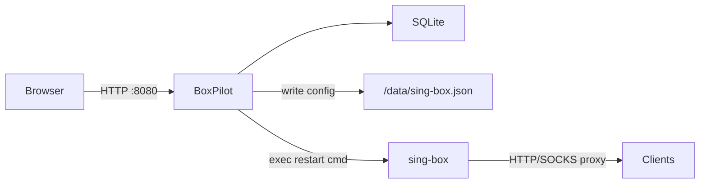

# BoxPilot

BoxPilot is a self-hosted control plane for sing-box, focused on one scope:
**provide HTTP/SOCKS inbounds and manage node outbounds safely**.

Tech stack: Go + Gin + SQLite + React + Vite.

## Current Scope

- Manage subscriptions and nodes
- Parse subscription formats:
  - traditional URI list
  - sing-box JSON
  - Clash YAML
  - base64 variants of the above
- Node forwarding selection (`forwarding_enabled`)
- Node testing (`http` / `ping`)
- Global proxy settings (HTTP + SOCKS5)
- Routing bypass settings (domains + CIDRs)
- Forwarding start/stop with runtime status
- Config apply with preflight + rollback safety

## Runtime Model

BoxPilot uses **process mode only**.

- BoxPilot generates `sing-box.json`
- Runs preflight: `sing-box check -c "$SINGBOX_CONFIG"`
- Restarts sing-box with `SINGBOX_RESTART_CMD`
- If restart fails, rolls back to last known good config

Single-container dual-process deployment is supported and is the default Docker path in this repo.


```mermaid
flowchart LR
  Browser -->|HTTP :8080| BoxPilot
  BoxPilot --> SQLite
  BoxPilot -->|write config| /data/sing-box.json
  BoxPilot -->|exec restart cmd| sing-box
  sing-box -->|HTTP/SOCKS proxy| Clients
```

## UI Overview

- Main tabs: `Dashboard`, `Subscriptions`, `Nodes`
- Right side actions: `Proxy` runtime toggle + `Settings` icon
- Dashboard: runtime summary, diagnostics, connections/logs snapshots
- Settings: HTTP/SOCKS config + forwarding policy + routing bypass

## Quick Start

### Option A (recommended): prebuilt flow

```bash
git clone <repo-url>
cd BoxPilot
make up-prebuilt
```

Open `http://localhost:8080`.

If needed, choose build architecture explicitly:

```bash
make PREBUILT_GOARCH=amd64 up-prebuilt
```

### Option B: standard compose build

```bash
docker compose up --build
```

Bind only localhost:

```bash
export BIND_IP=127.0.0.1
docker compose up --build
```

## Local Development

### Backend

```bash
cd server
ADDR=:8080 \
DB_PATH=../data/app.db \
SINGBOX_CONFIG=../data/sing-box.json \
SINGBOX_RESTART_CMD='pkill -HUP sing-box' \
go run .
```

### Frontend

```bash
cd web
npm ci
npm run dev
```

For SPA static serving from backend, set `WEB_ROOT` to built assets (`web/dist`).

## Make Targets

```bash
make build             # web + server
make build-prebuilt    # web + linux static server binary
make image-prebuilt    # build prebuilt runtime image
make up-prebuilt       # compose up with prebuilt flow
make test              # go test ./...
make migrate-gen       # generate OpenAPI types + restore compat layer
make diagnose          # API + proxy smoke diagnostics
```

## Forwarding Workflow (Important)

`Start Forwarding` needs eligible nodes. Default policy is strict (`healthy_only=true`, `allow_untested=false`).

Typical flow:

1. Import/refresh subscriptions
2. Enable forwarding on selected nodes
3. Run node tests (`Test All Nodes` or selected)
4. Start forwarding

If step 3 is skipped under strict policy, you may get `CFG_NO_ENABLED_NODES`.

When forwarding is already running, changing node forwarding flags or refreshing/deleting subscriptions will trigger an automatic debounced runtime reload (rapid updates are coalesced).

## Environment Variables

| Variable | Default | Required | Description |
|---|---|---|---|
| `ADDR` | `:8080` | no | Server listen address |
| `DB_PATH` | auto (`/data/app.db` if `/data` exists; else `data/app.db`) | no | SQLite file path |
| `WEB_ROOT` | unset | no | Static web root for SPA |
| `SINGBOX_CONFIG` | auto (`/data/sing-box.json` or `data/sing-box.json`) | yes for apply/restart | Runtime config path |
| `SINGBOX_RESTART_CMD` | unset | yes for apply/restart | Restart command (process mode contract) |
| `SINGBOX_CHECK_CMD` | `sing-box check -c "$SINGBOX_CONFIG"` | no | Preflight check command |
| `SINGBOX_CLASH_API_ADDR` | `127.0.0.1:9090` | no | Runtime traffic source (`off` to disable) |
| `SINGBOX_CLASH_API_SECRET` | unset | no | Optional auth token for Clash API |
| `HTTP_PROXY_PORT` | unset | no | Optional bootstrap HTTP inbound port |
| `SOCKS_PROXY_PORT` | unset | no | Optional bootstrap SOCKS inbound port |
| `BACKUP_KEEP` | unset | no | Config backup retention for runtime apply |

Container helper vars: `SINGBOX_LOG`, `SINGBOX_PID_FILE`.

## API Groups

Base path: `/api/v1`

- Subscriptions: list/create/update/delete/refresh
- Nodes: list/update/test/batch-forwarding/restart-forwarding
- Runtime: status/traffic/connections/logs/proxy-check/plan/reload
- Settings: proxy/routing/forwarding policy + forwarding start/stop

Reference: [docs/api.openapi.yaml](docs/api.openapi.yaml)

## Frontend Type Generation

`web/src/api/types.ts` is not pure generated output.

- generated: `web/src/api/types.gen.ts`
- compatibility layer: `web/src/api/types.compat.ts`
- app import target: `web/src/api/types.ts`

Use:

```bash
cd web
npm run gen:types
npm run prepare:types
```

or:

```bash
make migrate-gen
```

## Troubleshooting

### `404 page not found` when opening `/nodes` directly

- ensure `WEB_ROOT` is set
- ensure `web/dist` exists in runtime image/container

### `CFG_NO_ENABLED_NODES`

No eligible nodes passed policy filters. Check:

```bash
curl --noproxy '*' http://127.0.0.1:8080/api/v1/settings/forwarding/summary
curl --noproxy '*' http://127.0.0.1:8080/api/v1/settings/forwarding/policy
```

### Verify proxy forwarding quickly

```bash
curl --noproxy '' --proxy http://127.0.0.1:7890 https://ipinfo.io/json
```

### Run built-in diagnostics

```bash
make diagnose
```

## Security Notes

- Do not expose open proxy ports directly to public Internet.
- If listening on `0.0.0.0`, enable auth and use firewall restrictions.
- Do not commit subscription URLs/tokens.
- Restrict `SINGBOX_RESTART_CMD` to trusted scripts/paths only.

## Project Structure

```text
BoxPilot/
  docs/
  docker/
  scripts/
  server/
  web/
  docker-compose.yml
  docker-compose.prebuilt.yml
  Dockerfile
```

## Docs

- [Architecture](docs/architecture.md)
- [OpenAPI](docs/api.openapi.yaml)
- [Error Codes](docs/error-codes.md)
- [Migrations](docs/migrations.md)


## License

MIT
